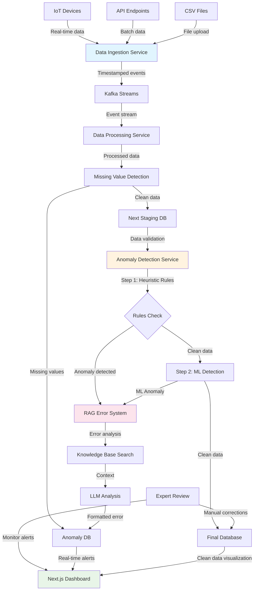

# Real-Time Monitoring Dashboard - Architecture Overview

## System Overview

This is a comprehensive real-time monitoring dashboard system designed to work across both Azure and AWS ecosystems. It implements an event-driven architecture with Apache Kafka for data streaming and provides advanced anomaly detection with RAG-based error reporting.

## Key Features

- **Multi-Cloud Support**: Native integration with both Azure and AWS services
- **Event-Driven Architecture**: Kafka-based streaming for real-time data processing
- **2-Step Anomaly Detection**: Heuristic rules + Machine Learning
- **RAG Error Reporting**: Knowledge-based error analysis with LLM integration
- **Real-Time Dashboard**: Next.js dashboard with live data visualization
- **Expert Review System**: Manual review and correction capabilities

## Data Flow Architecture

## Component Details

### 1. Data Ingestion Layer

**Purpose**: Handle both real-time IoT data and batch data processing

**Technologies**:
- **Azure**: IoT Hub, Event Hubs, Data Factory, Blob Storage
- **AWS**: IoT Core, MSK, Glue, S3

**Endpoints**:
- `POST /ingest/realtime` - Real-time IoT data
- `POST /ingest/batch` - Batch API data
- `POST /ingest/csv` - CSV file upload

**Features**:
- Data validation and enrichment
- Automatic timestamping
- Multi-format support (JSON, CSV, API)
- Error handling and retry logic

### 2. Stream Processing (Kafka)

**Purpose**: Event-driven data streaming between services

**Topics**:
- `iot-data-ingestion` - Real-time IoT events
- `batch-data-ingestion` - Batch data events
- `data-processing-output` - Processed data
- `rag-error-reporting` - Error events
- `dashboard-alerts` - Real-time alerts
- `final-data-storage` - Clean data storage

**Configuration**:
- Partitioned for scalability
- Configurable retention policies
- Auto-topic creation
- Consumer group management

### 3. Data Processing Service

**Purpose**: Process and clean incoming data streams

**Functions**:
- Data transformation and normalization
- Missing value detection and handling
- Data quality validation
- Schema validation

**Native Cloud Tools**:
- **Azure**: Azure Data Factory, Azure Stream Analytics
- **AWS**: AWS Glue, Amazon Kinesis Analytics

### 4. Anomaly Detection Service

**Purpose**: 2-step anomaly detection process

#### Step 1: Heuristic Rules Engine
- Configurable business rules
- Threshold-based detection
- Pattern matching
- Rule management API

#### Step 2: Machine Learning Engine
- Isolation Forest algorithms
- Time series anomaly detection
- Auto-retraining capabilities
- Model versioning

**Native Cloud Tools**:
- **Azure**: Azure Machine Learning, Azure Cognitive Services
- **AWS**: Amazon SageMaker, Amazon Comprehend

### 5. RAG Error Reporting System

**Purpose**: Intelligent error analysis and reporting

**Components**:
- **Knowledge Base**: Searchable error documentation
- **LLM Integration**: Context-aware error analysis
- **Error Classification**: Severity and category assignment
- **Recommendation Engine**: Actionable remediation steps

**Native Cloud Tools**:
- **Azure**: Azure Cognitive Search, Azure OpenAI
- **AWS**: Amazon Kendra, Amazon Bedrock

**Workflow**:
1. Receive error from anomaly detection
2. Search knowledge base for similar issues
3. Generate LLM analysis with context
4. Store formatted error report
5. Send alert to monitoring dashboard

### 6. Next.js Dashboard

**Purpose**: Real-time monitoring and visualization

**Features**:
- Real-time data visualization
- Anomaly alert management
- Expert review interface
- System health monitoring
- Multi-cloud deployment support

**Native Cloud Tools**:
- **Azure**: Azure Static Web Apps
- **AWS**: AWS Amplify

## Database Architecture

### Staging Database
- **Technology**: PostgreSQL (AWS RDS) / Azure SQL Database
- **Purpose**: Temporary storage for incoming data
- **Schema**: Time-series optimized tables

### Anomaly Database
- **Technology**: DynamoDB (AWS) / Cosmos DB (Azure)
- **Purpose**: Store anomaly reports and error logs
- **Features**: Auto-scaling, global distribution

### Final Database
- **Technology**: PostgreSQL (AWS RDS) / Azure SQL Database
- **Purpose**: Clean, validated data storage
- **Features**: Backup, high availability

### Knowledge Database
- **Technology**: Vector database integration
- **Purpose**: RAG system knowledge base
- **Features**: Semantic search, document indexing

## Security Architecture

### Authentication & Authorization
- **Azure**: Azure Active Directory, Managed Identity
- **AWS**: IAM roles and policies
- **Features**: Least privilege access, role-based permissions

### Network Security
- **Azure**: Virtual Networks, Network Security Groups
- **AWS**: VPCs, Security Groups
- **Features**: Private subnets, network isolation

### Data Protection
- **Encryption**: At rest and in transit
- **Secrets Management**: Azure Key Vault / AWS Secrets Manager
- **Compliance**: GDPR, SOC 2, ISO 27001 ready

## Monitoring & Observability

### Application Monitoring
- **Azure**: Application Insights
- **AWS**: CloudWatch
- **Metrics**: Custom business KPIs, system health

### Infrastructure Monitoring
- **Technology**: Prometheus + Grafana
- **Features**: Real-time metrics, alerting, dashboards

### Logging
- **Structured Logging**: JSON format with correlation IDs
- **Centralized**: ELK stack or cloud-native solutions
- **Retention**: Configurable retention policies

## Scalability & Performance

### Auto-Scaling
- **Container Services**: Horizontal pod autoscaling
- **Databases**: Auto-scaling capabilities
- **Message Queues**: Partition scaling

### Caching Strategy
- **Redis**: Session caching, frequently accessed data
- **CDN**: Static content delivery
- **Database**: Query result caching

### Load Distribution
- **Load Balancers**: Application and network level
- **Geographically Distributed**: Multi-region deployment
- **Traffic Management**: Blue-green deployments

## Deployment Architecture

### Infrastructure as Code
- **Terraform**: Multi-cloud infrastructure provisioning
- **Modules**: Reusable infrastructure components
- **State Management**: Remote state storage

### CI/CD Pipeline
- **GitHub Actions**: Automated testing and deployment
- **Container Registry**: Azure ACR / AWS ECR
- **Deployment**: Rolling updates, health checks

### Environment Management
- **Development**: Local Docker Compose
- **Staging**: Cloud-based testing environment
- **Production**: High-availability cloud deployment

## Best Practices Implemented

### Event-Driven Architecture
- **Loose Coupling**: Services communicate via events
- **Resilience**: Retry mechanisms and circuit breakers
- **Scalability**: Independent service scaling

### Microservices Pattern
- **Single Responsibility**: Each service has one purpose
- **Independent Deployment**: Services can be deployed separately
- **Technology Diversity**: Choose best tool for each job

### Data Lake Architecture
- **Staged Processing**: Bronze, Silver, Gold data layers
- **Schema Evolution**: Handle changing data structures
- **Data Governance**: Lineage tracking and quality metrics

### Cloud-Native Principles
- **12-Factor App**: Stateless, configuration externalization
- **Container-First**: All services containerized
- **API-First**: RESTful interfaces with OpenAPI specs

## Performance Characteristics

### Throughput
- **Data Ingestion**: 10,000+ events/second
- **Anomaly Detection**: Sub-second processing
- **Dashboard Updates**: Real-time WebSocket updates

### Latency
- **End-to-End**: < 5 seconds from ingestion to dashboard
- **API Response**: < 100ms for dashboard queries
- **Alert Generation**: < 30 seconds for anomaly detection

### Availability
- **Target**: 99.9% uptime
- **Recovery**: < 5 minutes RTO, < 1 hour RPO
- **Multi-Region**: Active-passive deployment option

## Cost Optimization

### Resource Management
- **Auto-scaling**: Scale down during low usage
- **Reserved Instances**: Predictable workload optimization
- **Spot Instances**: Cost-effective batch processing

### Storage Optimization
- **Lifecycle Policies**: Automatic data archiving
- **Compression**: Reduce storage costs
- **Intelligent Tiering**: Automatic cost optimization

### Monitoring
- **Cost Alerts**: Budget monitoring and alerts
- **Usage Analytics**: Resource utilization tracking
- **Right-sizing**: Regular capacity planning

## Future Enhancements

### Advanced Analytics
- **Predictive Analytics**: Forecast anomalies
- **Machine Learning Pipeline**: Automated model training
- **Deep Learning**: Complex pattern recognition

### Integration Capabilities
- **Third-party APIs**: External service integration
- **Webhook Support**: Event notifications
- **Plugin Architecture**: Extensible functionality

### Advanced Features
- **Multi-tenancy**: Support multiple organizations
- **Advanced Visualization**: 3D charts, AR/VR dashboards
- **Mobile App**: Native mobile dashboard application

This architecture provides a robust, scalable, and maintainable foundation for real-time monitoring across multi-cloud environments while implementing industry best practices for event-driven systems. 