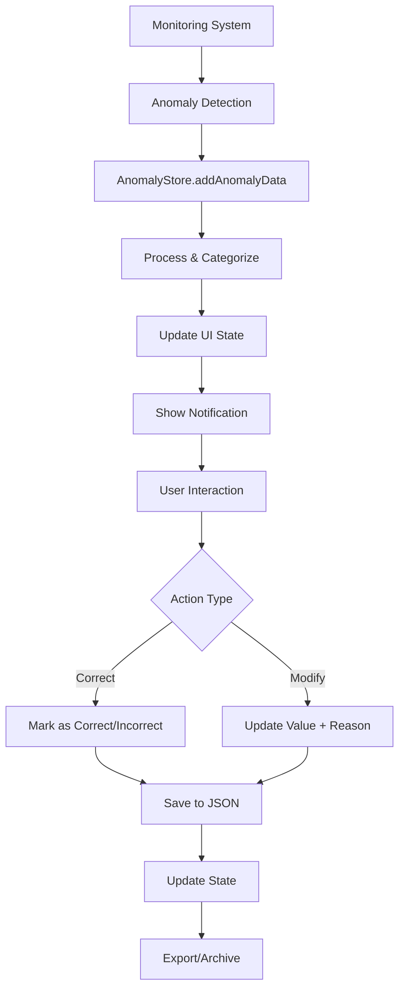

# Anomaly Detection System

## Overview

The Anomaly Detection System is a comprehensive solution for monitoring, processing, and managing anomalies detected in industrial processes. It provides real-time notifications, user interactions for anomaly validation, and persistent storage of anomaly data.

## Features

### 🚨 Real-time Anomaly Detection
- **Live Monitoring**: Continuous monitoring of critical metrics
- **Multi-level Severity**: Critical, High, Medium, Low severity levels
- **Smart Notifications**: Unread counter with visual indicators
- **Context-aware Alerts**: Detailed context and recommendations

### 🎯 User Actions
Users can take two types of actions on detected anomalies:

#### 1. **Correct Action**
- Mark anomaly detection as **correct** or **incorrect**
- Add optional notes for documentation
- Helps improve anomaly detection accuracy

#### 2. **Modify Action** 
- Correct the detected value with the actual value
- Provide reason for the correction
- Maintains audit trail of modifications

### 📊 Data Management
- **Persistent Storage**: JSON file storage with NoSQL backup
- **Export Functionality**: Download anomaly data as JSON
- **Auto-cleanup**: Remove processed anomalies
- **Historical Tracking**: Maintain audit trail of all actions

## Architecture

### Components

```
📁 components/dashboard/
├── AnomalyIcon.tsx           # Header notification icon
├── AnomalyDrawer.tsx         # Right-side drawer interface
├── AnomalyItem.tsx           # Individual anomaly item
├── AnomalyDemo.tsx           # Demo/testing component
└── AnomalyDrawerProvider.tsx # State management wrapper

📁 stores/
└── anomaly-store.ts          # Zustand state management

📁 types/
└── anomaly.ts               # TypeScript type definitions

📁 lib/
└── anomaly-server-actions.ts # Server-side file operations
```

### Data Flow



## Data Structure

### Anomaly Detection Input
```typescript
interface AnomalyData {
  timestamp: string
  method: string
  results: {
    WATER_FLOW_RATE?: AnomalyDetectionResult
    CO2_FLOW_RATE?: AnomalyDetectionResult
    LIQUID_TRACER_FLOW_RATE?: AnomalyDetectionResult
    INJECTION_PRESSURE?: AnomalyDetectionResult
    HASA_4_TUBING_PRESSURE?: AnomalyDetectionResult
    WATER_TO_CO2_RATIO?: AnomalyDetectionResult
  }
  processing_time_ms: number
}

interface AnomalyDetectionResult {
  value: number
  alarm_type: string  // "OK", "Low", "High", "Low-Low", "High-High"
  status: string      // "Normal", "Anomaly"
  context: string     // Detailed explanation and recommendations
}
```

### Processed Anomaly
```typescript
interface ProcessedAnomaly {
  id: string
  timestamp: string
  metricName: string
  metricDisplayName: string
  originalData: AnomalyDetectionResult
  action?: AnomalyCorrectAction | AnomalyModifyAction
  isProcessed: boolean
  severity: 'low' | 'medium' | 'high' | 'critical'
}
```

### User Actions
```typescript
// Marking anomaly as correct/incorrect
interface AnomalyCorrectAction {
  type: 'correct'
  timestamp: string
  correctDetection: boolean  // true = correct, false = wrong
  notes?: string
}

// Modifying the detected value
interface AnomalyModifyAction {
  type: 'modify'
  timestamp: string
  originalValue: number
  correctedValue: number
  reason?: string
}
```

## Usage

### 1. Detecting Anomalies
```typescript
import { useAnomalyStore } from '@/stores/anomaly-store'

const { addAnomalyData } = useAnomalyStore()

// Add new anomaly detection result
addAnomalyData(anomalyDetectionData)
```

### 2. Processing Anomalies
```typescript
const { markAnomalyAsCorrect, modifyAnomalyValue } = useAnomalyStore()

// Mark as correct detection
markAnomalyAsCorrect(anomalyId, true, "Confirmed by operator")

// Mark as incorrect detection  
markAnomalyAsCorrect(anomalyId, false, "False positive")

// Modify the value
modifyAnomalyValue(anomalyId, 125.5, "Sensor calibration offset")
```

### 3. Managing Data
```typescript
const { 
  clearProcessedAnomalies, 
  exportAnomaliesAsJSON,
  markAllNotificationsAsRead 
} = useAnomalyStore()

// Export data
const jsonData = exportAnomaliesAsJSON()

// Clear processed items
clearProcessedAnomalies()

// Mark all as read
markAllNotificationsAsRead()
```

## Integration

### Adding to Header
The anomaly icon is automatically integrated into the main header:

```typescript
import AnomalyIcon from './AnomalyIcon'
import { useAnomalyStore } from '@/stores/anomaly-store'

const { unreadCount, isDrawerOpen, toggleDrawer } = useAnomalyStore()

<AnomalyIcon 
  unreadCount={unreadCount}
  onClick={toggleDrawer}
  isOpen={isDrawerOpen}
/>
```

### Adding to Layout
The drawer is integrated into the root layout:

```typescript
import AnomalyDrawerProvider from '@/components/dashboard/AnomalyDrawerProvider'

// In layout
<AnomalyDrawerProvider />
```

## Demo & Testing

Use the `AnomalyDemo` component to test the system:

```typescript
import AnomalyDemo from '@/components/dashboard/AnomalyDemo'

// Add to any page for testing
<AnomalyDemo />
```

The demo provides:
- **Sample Anomaly**: Add the provided sample data
- **Random Anomaly**: Generate random anomalies for testing
- **Multiple Anomalies**: Create several anomalies at once

## Storage

### JSON File Storage
- **Location**: `/data/anomalies/anomaly-data.json`
- **Format**: Structured JSON with anomalies and notifications
- **Backup**: localStorage backup for client-side persistence

### Server Actions
```typescript
import { 
  saveAnomalyDataToFile, 
  readAnomalyDataFromFile,
  processAnomalyDetection 
} from '@/lib/anomaly-server-actions'

// Save to file
await saveAnomalyDataToFile(data)

// Read from file  
const result = await readAnomalyDataFromFile()

// Process new detection
await processAnomalyDetection(anomalyData)
```

## UI Features

### Anomaly Icon
- **Visual Indicator**: Triangle icon with pulsing animation
- **Badge Counter**: Shows unread anomaly count
- **Hover Effects**: Glow effects and state indicators
- **Responsive**: Adapts to different screen sizes

### Side Drawer
- **Right-side Panel**: Slides from right edge
- **Filtering**: Filter by status, severity, search
- **Statistics**: Show processed vs unprocessed counts
- **Export**: Download data as JSON file
- **Responsive**: Mobile-friendly design

### Anomaly Items
- **Severity Indicators**: Color-coded severity levels
- **Context Display**: Show detailed anomaly context
- **Action Buttons**: Process, correct, modify actions
- **Status Tracking**: Visual indicators for processed items
- **Timestamp Display**: Human-readable timestamps

## Severity Mapping

| Alarm Type | Severity | Color | Description |
|------------|----------|-------|-------------|
| Low-Low    | Critical | Red   | Extremely low values |
| Low        | Medium   | Amber | Below normal range |
| Normal     | Low      | Blue  | Within normal range |
| High       | Medium   | Amber | Above normal range |
| High-High  | Critical | Red   | Extremely high values |

## Best Practices

### 1. **Regular Processing**
- Process anomalies promptly to maintain system accuracy
- Add meaningful notes for future reference
- Use modify action when sensor calibration is needed

### 2. **Data Management**
- Export data regularly for backup
- Clear processed anomalies periodically
- Monitor storage usage for large datasets

### 3. **Integration**
- Connect to your monitoring systems via the `addAnomalyData` method
- Use server actions for persistent storage
- Implement real-time data feeds for continuous monitoring

### 4. **Customization**
- Modify severity mapping based on your requirements
- Adjust notification thresholds
- Customize metric display names and units

## Future Enhancements

- **Database Integration**: NoSQL database storage
- **API Endpoints**: REST API for external integrations
- **Machine Learning**: Improve detection accuracy based on user feedback
- **Dashboard Analytics**: Trends and patterns analysis
- **Mobile App**: Dedicated mobile interface
- **Email Notifications**: Alert stakeholders of critical anomalies
