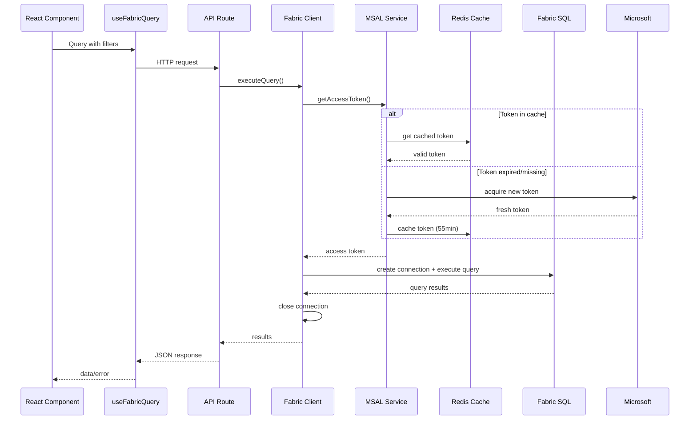

# Microsoft Fabric SQL Connection Architecture

## Overview

This implementation uses **per-request connections** with Microsoft Entra (Azure AD) tokens for accessing Microsoft Fabric SQL Analytics Endpoints. This approach is specifically designed for token-based authentication and avoids connection pooling issues.

## Why Per-Request Connections?

### ✅ Recommended for Token-Based Access
- **Fresh Tokens**: Each request gets a fresh token from MSAL
- **Security**: No risk of using expired tokens
- **Simplicity**: Easier token lifecycle management
- **Reliability**: No connection state management issues

### ❌ Why Not Connection Pooling?
- **Token Expiration**: Pooled connections may hold expired tokens
- **Token Context**: Each token is user/application specific
- **Complexity**: Token refresh becomes complicated
- **Security Risk**: Potential token reuse across contexts

## Architecture Components

### 1. MSAL Token Service (`lib/msal-service.ts`)
```typescript
// Acquires and caches Azure AD tokens
const tokenService = getMSALTokenService()
const accessToken = await tokenService.getAccessToken()
```

**Features:**
- Uses `@azure/msal-node` for token acquisition
- Caches tokens in Redis for ~55 minutes (5 min buffer)
- Automatic token refresh before expiration
- Support for different scopes

### 2. Fabric SQL Client (`lib/fabric-client.ts`)
```typescript
// Creates fresh connection for each request
const client = getFabricSQLClient()
const result = await client.executeQuery(baseQuery, options)
```

**Features:**
- Fresh connection per request (no pooling)
- Dynamic query building with filters
- Proper connection cleanup
- Support for parameterized queries

### 3. API Routes (`app/api/fabric-query/route.ts`)
```typescript
// GET /api/fabric-query?type=sales_data&filters=[...]
// POST /api/fabric-query with custom query
```

**Features:**
- Predefined query types
- Dynamic filtering via URL parameters or JSON body
- Pagination and sorting support
- Error handling with recommendations

### 4. React Hooks (`hooks/useFabricQuery.ts`)
```typescript
// Easy-to-use hooks for common patterns
const { data, isLoading, error } = useFabricQuery({
  queryType: 'sales_data',
  filters: [{ field: 'region', operator: 'eq', value: 'US' }]
})
```

## Connection Flow



## Dynamic Query Filtering

### Supported Filter Operations
```typescript
interface QueryFilter {
  field: string
  operator: 'eq' | 'ne' | 'gt' | 'gte' | 'lt' | 'lte' | 'like' | 'in' | 'between'
  value: any
}
```

### Example Usage
```typescript
// URL parameters
/api/fabric-query?type=sales_data&filters=[{"field":"region","operator":"eq","value":"US"}]

// POST body
{
  "query": "SELECT * FROM sales_transactions",
  "filters": [
    { "field": "sale_date", "operator": "gte", "value": "2024-01-01" },
    { "field": "region", "operator": "in", "value": ["US", "CA"] }
  ],
  "orderBy": "sale_date",
  "orderDirection": "DESC",
  "limit": 100
}
```

## Environment Configuration

```bash
# Azure AD/Entra Configuration (for MSAL)
AZURE_AD_CLIENT_ID=your-client-id
AZURE_AD_CLIENT_SECRET=your-client-secret
AZURE_AD_TENANT_ID=your-tenant-id

# Fabric SQL Endpoint
FABRIC_SQL_SERVER=your-fabric-endpoint.sql.azuresynapse.net
FABRIC_SQL_DATABASE=your-database
FABRIC_SQL_PORT=1433

# Redis for token caching
REDIS_URL=redis://localhost:6379
```

## Best Practices

### ✅ Do
- Use per-request connections for token-based auth
- Cache tokens (not connections) for performance
- Implement proper error handling
- Log connection events for debugging
- Use parameterized queries to prevent SQL injection

### ❌ Don't
- Use connection pooling with token authentication
- Cache database connections
- Ignore token expiration
- Mix token contexts
- Trust user input without validation

## Monitoring & Debugging

### Connection Logging
```bash
🔄 Creating fresh connection with new token for this request
🎫 Using cached MSAL token
✅ Fresh connection established
📊 Executing query with 2 parameters
🔒 Connection closed
```

### Test Component
Use `FabricConnectionTest` component to:
- Test connection status
- Try different query types
- Test custom queries with filters
- Monitor execution times

## Performance Considerations

### Token Caching Strategy
- **Cache Duration**: 55 minutes (5 min safety buffer)
- **Cache Location**: Redis for persistence across app restarts
- **Cache Key**: Based on scope to support multiple token types

### Query Optimization
- Use pagination for large result sets
- Implement proper indexing on filter fields
- Monitor query execution times
- Consider query result caching for expensive operations

## Security Notes

- Tokens are stored encrypted in Redis
- No sensitive data in URL parameters
- Proper input validation and sanitization
- Connection strings use encrypted channels (TLS)
- Fresh tokens prevent token replay attacks 